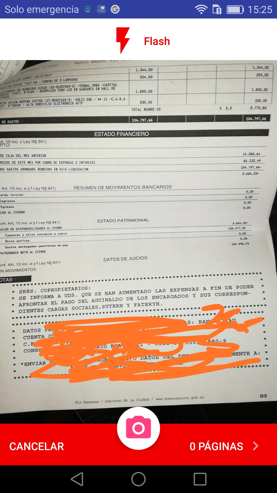

# camera-plugin
Multiple snapshots apache cordova camera plugin

This is an apache cordova plugin designed for android platform that allows you to take multiple snapshots and render them 
in an unique .pdf file, this would be useful in case you want to have in a document several invoices for example.

<p align="center">
  
</p>

The integration with phonegap or ionic framework is pretty straight forward, you just have to install the plugin via cli 
this way:

First, generate the destination platform

```console
foo@bar:~$ ionic platform add android
```
Finally, install the plugin

```console
foo@bar:~$ ionic plugin add https://github.com/wwleak/camera-plugin.git
```

And that's it.
